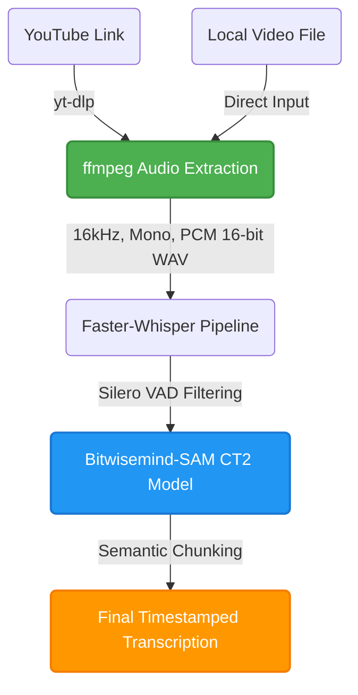

# 10. Final Pipeline

With our ideal model selected and the parameters tuned, we have established the final, highly-optimized Bengali ASR pipeline. The system is designed to take either a direct YouTube link or a local video file, handle all necessary preprocessing steps automatically, and output a clean, timestamped transcription.

### Pipeline Architecture

Below is a visualization of the data flow in our final pipeline:

### 1. Data Ingestion & Preprocessing
The pipeline accepts two types of inputs:
- **YouTube Links**: If a URL is provided, `yt-dlp` fetches the best available audio stream.
- **Local Videos**: If a local file is provided, it skips the download step.

Regardless of the source, the media is piped through `ffmpeg`. `ffmpeg` is strictly configured to output a **16 kHz, Mono, PCM 16-bit WAV** file. This normalizes all inputs to the exact format expected by Whisper's feature extractor, preventing any unexpected acoustic artifacts.

### 2. Transcription Engine
The normalized audio is passed to the `BatchedInferencePipeline` utilizing our custom-compiled **CTranslate2 Bitwisemind-SAM model**. 
- **VAD Filtering**: Before processing, the built-in Silero Voice Activity Detection (VAD) filters out prolonged silences and background noise segments. This is crucial for eliminating the hallucinations common in Whisper models.
- **Batch Processing**: The audio is processed in batches (e.g., `batch_size=16`), maximizing GPU throughput and significantly accelerating the transcription of long videos.

### 3. Chunking & Output Formatting
The raw word-level timestamps generated by the model are parsed by our custom `stream_chunks` algorithm. It aggregates words intelligently based on:
- Grammatical boundaries (punctuation like `.` or `?`).
- Temporal gaps (pauses longer than a specified `max_gap`).
- Maximum word counts per chunk.

The final result is a highly accurate, easily readable, and perfectly timed transcription ready for subtitle generation or downstream NLP tasks.
