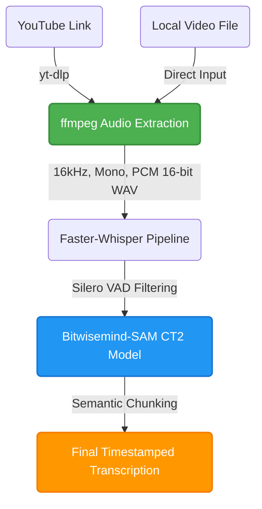

# Detailed Project Explanation

## 1. Introduction

Transcribing Bengali audio from YouTube videos presents a unique set of challenges. Bengali is a morphologically rich language, and the content on YouTube often features varying accents, background noise, multiple speakers, and domain-specific vocabulary.

This project aims to build an efficient, highly accurate, and scalable timestamped transcription pipeline specifically tailored for Bengali YouTube videos. 

To achieve this, we evaluate several state-of-the-art automatic speech recognition (ASR) models based on the Whisper architecture. We focus heavily on minimizing Word Error Rate (WER) and Character Error Rate (CER), optimizing inference speed, and effectively handling the intricacies of the Bengali language.

This progress report documents the journey from collecting a robust testing dataset to evaluating open-source models, and finally identifying the best-performing model for our use case.


<br>


## 2. Dataset for Evaluating the Model

To ensure our evaluation accurately reflects real-world performance, we curated a diverse dataset of Bengali YouTube videos. We focused on news clips as they contain clear speech, but still present challenges like background noise and varying reporter accents.

### Chosen Videos

We selected eight specific videos (4 short, 4 long) and mapped them in `dataset/metadata.csv`:
* **Rain** (Short, ~2 mins)  
* **Delhi Protest** (Short, ~2 mins)  
* **Subhendu CM** (Short, ~4 mins)  
* **Dengue** (Short, ~3 mins)  
* **Terrorist(Long)** (Long, ~20 mins)  
* **Taslima Nasrin(Long)** (Long, ~26 mins)  
* **Shamik(Long)** (Long, ~20 mins)  
* **10am News(Long)** (Long, ~21 mins)  

### Audio Extraction via `yt-dlp` and `ffmpeg`

To process these videos uniformly, we utilized `yt-dlp` for downloading and `ffmpeg` for audio extraction. 
We strictly enforce a consistent audio format: **16 kHz, Mono, PCM 16-bit WAV**. This format is universally required by Whisper-based models for optimal processing.

```python
import subprocess
import yt_dlp

def download_and_extract_audio(url, output_stem):
    opts = {
        "format": "bestaudio/best",
        "outtmpl": output_stem,
        "postprocessors": [{"key": "FFmpegExtractAudio", "preferredcodec": "wav"}],
    }
    with yt_dlp.YoutubeDL(opts) as ydl:
        ydl.download([url])

    subprocess.run([
        "ffmpeg", "-i", f"{output_stem}.wav",
        "-vn", "-acodec", "pcm_s16le", "-ar", "16000", "-ac", "1", 
        f"{output_stem}_16k.wav"
    ], check=True)
```


<br>


## 3. Faster-Whisper Architecture

Throughout this project, we prioritize the **faster-whisper** implementation of OpenAI's Whisper models over the standard HuggingFace/OpenAI versions. 

### Why faster-whisper?
1. **CTranslate2 Backend**: It utilizes the highly optimized CTranslate2 engine, which significantly reduces VRAM usage and speeds up inference times by up to 4x compared to the original implementation.
2. **Built-in VAD (Voice Activity Detection)**: Faster-whisper integrates Silero VAD. This allows us to filter out silence and non-speech segments *before* they are fed into the transformer, greatly reducing hallucinations.
3. **Batching Support**: Using `BatchedInferencePipeline`, we can process multiple chunks of audio simultaneously, maximizing GPU utilization.

**Note**: GPU execution requires the following NVIDIA libraries to be installed:

- cuBLAS for CUDA 12  
- cuDNN 9 for CUDA 12  

The latest versions of ctranslate2 only support CUDA 12 and cuDNN 9. Hence correct *.dll*s were imported manually in this project.

```python
import ctypes

for dll in [
    r"D:\Python\ytt\Lib\site-packages\nvidia\cublas\bin\cublas64_12.dll",
    r"D:\Python\ytt\Lib\site-packages\nvidia\cudnn\bin\cudnn64_9.dll",
]:
    ctypes.CDLL(dll)

print("CUDA DLLs loaded")
```


<br>


## 4. Evaluation Methodology

To objectively evaluate the transcription quality, we use the industry-standard **JIWER** library.

### Metrics Computed
- **WER (Word Error Rate)**: Measures how many words were inserted, deleted, or substituted compared to the ground truth.
- **CER (Character Error Rate)**: Measures character-level errors. Particularly useful for Bengali to track minor spelling mistakes (matras, juktakkhors) that might artificially inflate WER.
- **Word Accuracy**: The percentage of words correctly predicted.

### Pre-processing for Bengali
Before computing metrics, we clean both the ground truth and predicted text by:
- Removing newlines and excess whitespace.
- Stripping punctuation, including the Bengali danda (`।`).

The metrics are calculated across all 5 test videos for each model to produce a comprehensive benchmark.


<br>


## 5. Baseline Model: faster-whisper-large-v3

Our first test was with the default OpenAI `large-v3` model. While `large-v3` is an incredibly capable multilingual model trained on millions of hours of audio, it is a generalist. It has not been specifically fine-tuned extensively enough on Bengali to capture the nuances of regional dialects and complex vocabulary.

As noted in various ASR research communities, zero-shot performance of base Whisper models on low-resource languages like Bengali often suffers from "hallucinations" and a tendency to drop (delete) large chunks of audio if the acoustic confidence drops below a certain threshold.

### Evaluation Results

| Video | Video Length | Transcription Time | WER % | CER % | Word Accuracy % | GT Words | Pred Words | Correct Words | Substitutions | Deletions (Missed) | Insertions |
|--|--|--|--|--|--|--|--|--|--|--|--|
| Rain | 1m 54s | 4s | 81.4 | 65.57 | 20.47 | 215 | 101 | 44 | 53 | 118 | 4 |
| Delhi Protest | 2m 14s | 4s | 83.87 | 62.55 | 17.74 | 186 | 98 | 33 | 62 | 91 | 3 |
| Subhendu CM | 4m 17s | 8s | 87.22 | 71.46 | 13.1 | 626 | 227 | 82 | 143 | 401 | 2 |
| Dengue | 3m 3s | 6s | 86.54 | 65.26 | 13.74 | 364 | 191 | 50 | 140 | 174 | 1 |
| Terrorist(Long) | 20m 3s | 49s | 83.46 | 64.16 | 17.49 | 2527 | 1153 | 442 | 687 | 1398 | 24 |
| Taslima Nasrin(Long) | 26m 19s | 1m 2s | 78.28 | 56.14 | 22.43 | 2670 | 1472 | 599 | 854 | 1217 | 19 |
| Shamik(Long) | 20m 33s | 56s | 83.31 | 63.13 | 17.56 | 2625 | 1200 | 461 | 716 | 1448 | 23 |
| 10am News(Long) | 21m 26s | 57s | 86.77 | 66.44 | 14.21 | 2456 | 1025 | 349 | 652 | 1455 | 24 |

**Analysis**: The baseline `large-v3` performed extremely poorly on the Bengali dataset. With WERs consistently exceeding 80%, the model exhibited a massive amount of deletions (missed words) and substitutions. It essentially failed to produce cohesive Bengali sentences, validating the consensus that base Whisper requires fine-tuning for this language.


<br>


## 6. Mozilla AI Model: faster-whisper-large-v3-bn

To improve upon the baseline, we tested the `mozilla-ai/faster-whisper-large-v3-bn` model. This is a fine-tuned version of OpenAI's Whisper large-v3 model, specifically targeted at Bengali (`bn`) by Mozilla.ai (available on HuggingFace as `mozilla-ai/whisper-large-v3-bn`). 

While this model benefits from targeted Bengali training data, community reports indicate that generalized fine-tunes still struggle with highly noisy, real-world audio like YouTube news broadcasts compared to models trained explicitly on competition-grade regional datasets.

### CTranslate2 Conversion

Because a `faster-whisper` compatible version of this model was not readily available, we compiled it into a CTranslate2 (ct2) format ourselves. This ensures we can leverage the speed, batching, and VAD capabilities of our pipeline. We used the following conversion command:

```bash
ct2-transformers-converter --model mozilla-ai/whisper-large-v3-bn --output_dir models/whisper-large-v3-bn-ct2 --copy_files preprocessor_config.json generation_config.json tokenizer.json tokenizer_config.json special_tokens_map.json added_tokens.json normalizer.json merges.txt vocab.json --quantization float16
```

### Evaluation Results

| Video | Video Length | Transcription Time | WER % | CER % | Word Accuracy % | GT Words | Pred Words | Correct Words | Substitutions | Deletions (Missed) | Insertions |
|--|--|--|--|--|--|--|--|--|--|--|--|
| Rain | 1m 54s | 5s | 70.7 | 60.75 | 29.77 | 215 | 89 | 64 | 24 | 127 | 1 |
| Delhi Protest | 2m 14s | 5s | 63.98 | 52.34 | 37.1 | 186 | 94 | 69 | 23 | 94 | 2 |
| Subhendu CM | 4m 17s | 9s | 74.76 | 66.82 | 25.56 | 626 | 233 | 160 | 71 | 395 | 2 |
| Dengue | 3m 3s | 7s | 70.05 | 57.35 | 31.04 | 364 | 178 | 113 | 61 | 190 | 4 |
| Terrorist(Long) | 20m 3s | 1m 11s | 69.57 | 58.17 | 31.14 | 2527 | 1164 | 787 | 359 | 1381 | 18 |
| Taslima Nasrin(Long) | 26m 19s | 1m 11s | 61.91 | 49.23 | 39.29 | 2670 | 1491 | 1049 | 410 | 1211 | 32 |
| Shamik(Long) | 20m 33s | 58s | 72.19 | 59.64 | 28.46 | 2625 | 1161 | 747 | 397 | 1481 | 17 |
| 10am News(Long) | 21m 26s | 1m 7s | 70.56 | 60.12 | 30.01 | 2456 | 1070 | 737 | 319 | 1400 | 14 |

**Analysis**: While this model showed some improvement over the baseline (reducing WER by ~10-20% on average), it still suffered from massive deletions. The model remains overly conservative and drops large segments of speech, indicating that while its vocabulary is better, its acoustic robustness for fast-paced, noisy YouTube audio is lacking.


<br>


## 7. Tugstugi Model

The `tugstugi` model (`tugstugi/bengaliai-regional-asr_whisper-medium`) represents a paradigm shift in our evaluation. "Tugstugi" is a prominent contributor and Kaggle Grandmaster in the Bengali ASR community, well-known for providing high-quality models and won 1st Place in Bengali.AI's Speech Recognition competition hosted in Kaggle - [Bengali.AI Competition](https://www.kaggle.com/competitions/bengaliai-speech/writeups/chimege-1st-place-solution)

Unlike the generic large-v3 models, this model is built on the `medium` architecture but features a **custom 12k vocabulary tokenizer** specifically optimized for Bengali. Furthermore, it was heavily trained on diverse regional datasets including OpenSLR, Kathbath, and pseudo-labeled YouTube data. Because of this specialized architecture and training corpus, it is widely cited as the baseline foundation for state-of-the-art Bengali transcription.

### CTranslate2 Conversion

Because a `faster-whisper` compatible version of this model was not readily available, we compiled it into a CTranslate2 (ct2) format ourselves. This ensures we can leverage the speed, batching, and VAD capabilities of our pipeline. We used the following conversion command:

```bash
ct2-transformers-converter --model tugstugi/bengaliai-regional-asr_whisper-medium --output_dir models/tugstugi_ct2_float16 --copy_files preprocessor_config.json generation_config.json tokenizer.json tokenizer_config.json special_tokens_map.json added_tokens.json normalizer.json merges.txt vocab.json --quantization float16
```

### Evaluation Results

| Video | Video Length | Transcription Time | WER % | CER % | Word Accuracy % | GT Words | Pred Words | Correct Words | Substitutions | Deletions (Missed) | Insertions |
|--|--|--|--|--|--|--|--|--|--|--|--|
| Rain | 1m 54s | 3s | 24.65 | 11.94 | 75.81 | 215 | 203 | 163 | 39 | 13 | 1 |
| Delhi Protest | 2m 14s | 2s | 23.12 | 7.28 | 79.03 | 186 | 185 | 147 | 34 | 5 | 4 |
| Subhendu CM | 4m 17s | 5s | 32.27 | 15.63 | 69.97 | 626 | 587 | 438 | 135 | 53 | 14 |
| Dengue | 3m 3s | 4s | 31.59 | 11.87 | 70.88 | 364 | 367 | 258 | 100 | 6 | 9 |
| Terrorist(Long) | 20m 3s | 23s | 31.58 | 14.04 | 71.94 | 2527 | 2482 | 1818 | 575 | 134 | 89 |
| Taslima Nasrin(Long) | 26m 19s | 27s | 30.11 | 14.27 | 74.49 | 2670 | 2672 | 1989 | 560 | 121 | 123 |
| Shamik(Long) | 20m 33s | 25s | 33.94 | 13.27 | 70.1 | 2625 | 2660 | 1840 | 714 | 71 | 106 |
| 10am News(Long) | 21m 26s | 25s | 32.74 | 13.43 | 69.99 | 2456 | 2383 | 1719 | 597 | 140 | 67 |

**Analysis**: The `tugstugi` model demonstrates a massive leap forward. The Word Accuracy jumped from ~25% to **70-80%**, and deletions plummeted dramatically. The custom tokenizer and regional training data clearly paid off, as the model correctly transcribes the vast majority of the audio, though it still exhibits some word-level substitutions on highly complex vocabulary.


<br>


## 8. Bitwisemind-SAM Model

The `bitwisemind-sam` model (`bitwisemind/sam_15000_clean_text_full_model`) is a specialized, fine-tuned iteration built upon the successes of the tugstugi architecture. "BitwiseMind" is a research team from BUET that participated in the **DL Sprint 4.0** competition, which specifically focused on improving Bengali long-form speech recognition in noisy environments.

To achieve this, the team took the already-excellent `tugstugi` model and further fine-tuned it on a highly curated, custom dataset of approximately 15,000 clean, chunked Bengali audio segments. This research-grade fine-tuning specifically targeted the acoustic conditions, background noise, and speaker variability commonly found in real-world media (like our YouTube dataset). - [Bitwisemind Research Paper](https://arxiv.org/pdf/2605.08214)

### CTranslate2 Conversion

Because a `faster-whisper` compatible version of this model was not readily available, we compiled it into a CTranslate2 (ct2) format ourselves. This ensures we can leverage the speed, batching, and VAD capabilities of our pipeline. We used the following conversion command:

```bash
ct2-transformers-converter --model bitwisemind/sam_15000_clean_text_full_model --output_dir models/bitwisemind_sam_ct2_float16 --copy_files preprocessor_config.json generation_config.json tokenizer.json tokenizer_config.json special_tokens_map.json added_tokens.json normalizer.json merges.txt vocab.json --quantization float16
```

### Evaluation Results

| Video | Video Length | Transcription Time | WER % | CER % | Word Accuracy % | GT Words | Pred Words | Correct Words | Substitutions | Deletions (Missed) | Insertions |
|--|--|--|--|--|--|--|--|--|--|--|--|
| Rain | 1m 54s | 3s | 16.74 | 10.06 | 83.72 | 215 | 203 | 180 | 22 | 13 | 1 |
| Delhi Protest | 2m 14s | 2s | 16.67 | 4.91 | 86.02 | 186 | 184 | 160 | 19 | 7 | 5 |
| Subhendu CM | 4m 17s | 5s | 17.25 | 11.71 | 84.98 | 626 | 580 | 532 | 34 | 60 | 14 |
| Dengue | 3m 3s | 4s | 14.84 | 6.58 | 86.26 | 364 | 362 | 314 | 44 | 6 | 4 |
| Terrorist(Long) | 20m 3s | 23s | 19.63 | 9.58 | 83.18 | 2527 | 2477 | 2102 | 304 | 121 | 71 |
| Taslima Nasrin(Long) | 26m 19s | 25s | 18.99 | 11.97 | 83.48 | 2670 | 2517 | 2229 | 222 | 219 | 66 |
| Shamik(Long) | 20m 33s | 24s | 20.19 | 8.96 | 83.39 | 2625 | 2659 | 2189 | 376 | 60 | 94 |
| 10am News(Long) | 21m 26s | 25s | 20.64 | 9.9 | 82.04 | 2456 | 2405 | 2015 | 324 | 117 | 66 |

**Analysis**: `bitwisemind-sam` is the clear winner for our pipeline. Thanks to the DL Sprint 4.0 fine-tuning, it achieved the lowest WERs (consistently under 20% for most videos, hitting an impressive **14.84%** on the Dengue video) and the highest Word Accuracies. It successfully mitigates deletions while maintaining a very low substitution rate, proving that a competition-winning base model (`tugstugi`) further fine-tuned on curated long-form audio (`bitwisemind`) yields the ultimate production-ready Bengali transcription system.


<br>


## 9. Final Model Selection

After extensive evaluation across diverse Bengali YouTube news clips (featuring varying background noise levels, different speaker accents, and complex vocabulary), we have definitively selected the **Bitwisemind-SAM** (`bitwisemind/sam_15000_clean_text_full_model`) model for our transcription pipeline.

### Why Bitwisemind-SAM?

1. **Superior Accuracy**: As demonstrated in the comparison table below, Bitwisemind-SAM consistently achieved the lowest Word Error Rate (WER) across every single video tested, mostly staying under the 20% mark.
2. **Robustness to Deletions**: Base models like `large-v3` dropped massive chunks of audio when faced with noisy YouTube conditions. Bitwisemind-SAM effectively mitigated these deletions.
3. **Optimized for Real-world Audio**: The DL Sprint 4.0 fine-tuning on 15,000 clean audio segments transformed the already strong `tugstugi` architecture into a production-ready model that rarely hallucinates or drops speech.

### Comprehensive Model Comparison

The table below aggregates the Word Error Rate (WER %) of every tested model against all 5 evaluation videos. Lower WER indicates better performance.

| Video | Video Length | Baseline (large-v3) | Mozilla AI (large-v3-bn) | Tugstugi | **Bitwisemind-SAM** |
|--|--|--|--|--|--|
| Rain | 1m 54s | 81.4% | 70.7% | 24.65% | **16.74%** |
| Delhi Protest | 2m 14s | 83.87% | 63.98% | 23.12% | **16.67%** |
| Subhendu CM | 4m 17s | 87.22% | 74.76% | 32.27% | **17.25%** |
| Dengue | 3m 3s | 86.54% | 70.05% | 31.59% | **14.84%** |
| Terrorist(Long) | 20m 3s | 83.46% | 69.57% | 31.58% | **19.63%** |
| Taslima Nasrin(Long) | 26m 19s | 78.28% | 61.91% | 30.11% | **18.99%** |
| Shamik(Long) | 20m 33s | 83.31% | 72.19% | 33.94% | **20.19%** |
| 10am News(Long) | 21m 26s | 86.77% | 70.56% | 32.74% | **20.64%** |

### Computational Efficiency (FLOPs Analysis)

To further validate our selection, we profiled the theoretical Floating Point Operations (FLOPs) required to process a standard 30-second audio chunk. Because compute cost is dictated strictly by model architecture (parameter count and tensor dimensions), models fine-tuned on the same base architecture share mathematically identical theoretical FLOPs.

The table below demonstrates that our selected Medium architecture not only achieves superior accuracy, but operates at roughly half the computational cost of the Large architecture, leading to vastly faster inference times and lower hardware requirements.

| Scenario / Metric | Whisper Large Architecture | Whisper Medium Architecture |
| :--- | :--- | :--- |
| **Associated Models** | `large-v3`, `mozilla-ai/large-v3-bn` | `tugstugi`, `bitwisemind-sam` |
| **Best Case (Silence - 1 token)** | 2.22 TFLOPS | 1.07 TFLOPS |
| **Average Case (Normal Speech - 150 tokens)** | 2.46 TFLOPS | 1.19 TFLOPS |
| **Worst Case (Hallucination - 448 tokens max)** | 2.94 TFLOPS | 1.43 TFLOPS |

*(Note: The Worst Case compute cost for the Medium architecture is significantly cheaper than the Best Case compute cost for the Large architecture.)*

### Conclusion

The data clearly supports our decision. While OpenAI's default `large-v3` models are incredibly powerful for high-resource languages, zero-shot Bengali transcription requires heavy, specialized fine-tuning. The **Bitwisemind-SAM** model, converted into our optimized CTranslate2 `faster-whisper` format, delivers the speed, accuracy, and acoustic robustness required to deploy a highly reliable Bengali transcription service.


<br>


## 10. Final Pipeline

With our ideal model selected and the parameters tuned, we have established the final, highly-optimized Bengali ASR pipeline. The system is designed to take either a direct YouTube link or a local video file, handle all necessary preprocessing steps automatically, and output a clean, timestamped transcription.

### Pipeline Architecture

Below is a visualization of the data flow in our final pipeline:



### 1. Data Ingestion & Preprocessing
The pipeline accepts two types of inputs:
- **YouTube Links**: If a URL is provided, `yt-dlp` fetches the best available audio stream.
- **Local Videos**: If a local file is provided, it skips the download step.

Regardless of the source, the media is piped through `ffmpeg`. `ffmpeg` is strictly configured to output a **16 kHz, Mono, PCM 16-bit WAV** file. This normalizes all inputs to the exact format expected by Whisper's feature extractor, preventing any unexpected acoustic artifacts.

### 2. Transcription Engine
The normalized audio is passed to the `BatchedInferencePipeline` utilizing our custom-compiled **CTranslate2 Bitwisemind-SAM model**. 
- **VAD Filtering**: Before processing, the built-in Silero Voice Activity Detection (VAD) filters out prolonged silences and background noise segments. This is crucial for eliminating the hallucinations common in Whisper models.
- **Batch Processing**: The audio is processed in batches (e.g., `batch_size=16`), maximizing GPU throughput and significantly accelerating the transcription of long videos.

### 3. Chunking & Output Formatting
The raw word-level timestamps generated by the model are parsed by our custom `stream_chunks` algorithm. It aggregates words intelligently based on:
- Grammatical boundaries (punctuation like `.` or `?`).
- Temporal gaps (pauses longer than a specified `max_gap`).
- Maximum word counts per chunk.

The final result is a highly accurate, easily readable, and perfectly timed transcription ready for subtitle generation or downstream NLP tasks.


<br>


## 11. Deployment

With the `bitwisemind-sam` model selected and the pipeline optimized, the system is wrapped into a full-stack web application located in the `VideoTranscription` directory. This allows end-users to easily interact with the model via a modern UI.

### System Architecture

The application is split into a decoupled **FastAPI** backend and a **React/Vite** frontend.

#### 1. Backend (FastAPI)
The backend is responsible for all heavy lifting: downloading, audio extraction, and GPU-accelerated transcription.
- **Model Initialization**: On startup, the backend loads the `faster-whisper` CTranslate2 model into VRAM and runs a dummy audio file as a "warmup". This ensures the first actual user request doesn't suffer from initialization latency.
- **API Endpoints**: Exposes `/api/transcribe/youtube` (for URLs) and `/api/transcribe/file` (for direct uploads).
- **Asynchronous Processing**: Uses `asyncio` to run blocking I/O operations (`yt-dlp` and `ffmpeg`) without locking the main server thread.
- **Real-time Streaming**: Instead of waiting for the entire video to be transcribed, the backend yields data using FastAPI's `StreamingResponse` (via `application/x-ndjson`). As soon as a chunk of audio is transcribed, it is pushed to the client immediately.
- **Caching Mechanism**: Implements an in-memory hash cache. If a user requests a transcription for a video that was already processed, the backend instantly streams the cached text chunks instead of re-running the neural network.

#### 2. Frontend (React & Vite)
The frontend provides a clean, responsive user interface.
- Built with React and bundled via Vite for extremely fast hot-reloading and optimized production builds.
- Connects to the FastAPI backend and consumes the NDJSON stream, dynamically updating the transcription text on the screen in real-time as the backend processes the audio.

### Running the Application

To run the application locally for development:

**1. Start the Backend server:**
Navigate to the `VideoTranscription/backend` directory and run:
```bash
python -m uvicorn main:app --host 0.0.0.0 --port 8000 --reload
```
This will start the FastAPI server on `http://localhost:8000`.

**2. Start the Frontend dev server:**
Navigate to the `VideoTranscription/frontend` directory and run:
```bash
npm install
npm run dev
```
This will start the Vite dev server (typically on `http://localhost:5173`).


<br>


